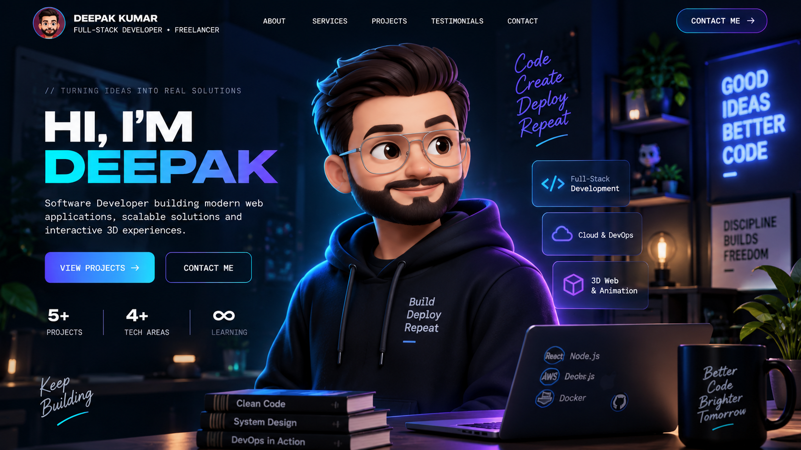

<div align="center">

# DEEPAK KUMAR

### ⚡ HIGH-PERFORMANCE 3D PORTFOLIO • MODERN WEB EXPERIENCE ⚡

<br/>



<br/><br/>

[](#)
[](https://github.com/darkroomengineering/lenis)
[](https://vitejs.dev/)
[](#)

</div>

---

## 🌐 Live Deployment

The portfolio is deployed online using Render.

> 🔗 **Live Portfolio:** https://deepak-portfolio-iene.onrender.com/

---

## 👨‍💻 About Me

**Deepak Kumar** is a Full Stack Developer and DevOps Engineer focused on building modern, high-performance, responsive, and scalable web applications.

I work across the complete development lifecycle — from frontend development and REST APIs to databases, cloud deployment, containerization, and CI/CD.

### What I Work With

* Full Stack Web Development
* React.js & JavaScript
* HTML5 & CSS3
* Node.js & Express.js
* REST APIs
* MySQL & MongoDB
* Docker & Docker Compose
* Kubernetes
* AWS Cloud
* Jenkins & CI/CD
* Git & GitHub
* Cloud Deployment & DevOps

---

## 🚀 Portfolio Overview

This portfolio is designed as an interactive web engineering showcase combining modern frontend development, smooth scrolling, animations, responsive UI, and a high-performance 3D canvas experience.

The project is built with a focus on:

* Modern UI/UX
* Responsive design
* Smooth scrolling
* Interactive animations
* Performance optimization
* Clean component architecture
* Production-ready deployment

---

## 🏗️ Architecture

```text
┌─────────────────────────────────────────────────────────────────────┐
│                         PORTFOLIO WEBSITE                           │
├─────────────────────────────────────────────────────────────────────┤
│                                                                     │
│  ┌───────────────────────────────────────────────────────────────┐  │
│  │                         FRONTEND                              │  │
│  │                                                               │  │
│  │  • React Components                                           │  │
│  │  • Responsive UI                                              │  │
│  │  • Hero Section                                               │  │
│  │  • About Section                                              │  │
│  │  • Skills & Services                                          │  │
│  │  • Projects                                                   │  │
│  │  • Certificates                                               │  │
│  │  • Contact Section                                            │  │
│  │                                                               │  │
│  └───────────────────────────────────────────────────────────────┘  │
│                                                                     │
│  ┌───────────────────────────────────────────────────────────────┐  │
│  │                    ANIMATION ENGINE                           │  │
│  │                                                               │  │
│  │  • HTML5 Canvas                                               │  │
│  │  • Smooth Scroll                                               │  │
│  │  • Frame Animation                                             │  │
│  │  • Interactive Effects                                         │  │
│  │                                                               │  │
│  └───────────────────────────────────────────────────────────────┘  │
│                                                                     │
│  ┌───────────────────────────────────────────────────────────────┐  │
│  │                       DEPLOYMENT                              │  │
│  │                                                               │  │
│  │  GitHub → Render → Live Portfolio                             │  │
│  │                                                               │  │
│  └───────────────────────────────────────────────────────────────┘  │
│                                                                     │
└─────────────────────────────────────────────────────────────────────┘
```

---

## ✨ Core Features

### 🎬 1. Interactive 3D Canvas

* Smooth frame-based animations
* HTML5 Canvas rendering
* Responsive high-DPI scaling
* Smooth scrolling integration
* Optimized frame loading
* Interactive visual experience

### 💎 2. Modern Glassmorphism UI

* Modern glass-style interface
* Transparent UI components
* Backdrop blur effects
* Smooth hover interactions
* Responsive layouts
* Modern typography and spacing

### 📜 3. Certificates & Achievements

The portfolio includes a dedicated certificates section for showcasing professional learning, technical certifications, and achievements.

Certificates can be browsed through an interactive interface with visual previews.

### 📂 4. Projects

The portfolio showcases full-stack and software development projects covering areas such as:

* Full Stack Web Applications
* E-Commerce Applications
* Real-Time Applications
* REST API Projects
* DevOps & CI/CD Projects
* Cloud Deployment
* Database Applications

---

## 🛠️ Tech Stack

| Category            | Technologies                      |
| :------------------ | :-------------------------------- |
| **Frontend**        | React.js, JavaScript, HTML5, CSS3 |
| **Styling**         | CSS3, Responsive Design           |
| **Animation**       | HTML5 Canvas, Lenis               |
| **Build Tool**      | Vite                              |
| **Backend**         | Node.js, Express.js               |
| **Database**        | MySQL, MongoDB                    |
| **DevOps**          | Docker, Kubernetes, Jenkins       |
| **Cloud**           | AWS                               |
| **Version Control** | Git, GitHub                       |
| **Deployment**      | Render                            |

---

## 📦 Local Development

### Prerequisites

* [Node.js](https://nodejs.org/)
* npm
* Git

### Setup

Clone the repository:

```bash
git clone https://github.com/deepakkumar37881/my-portfolio.git
```

Move into the project directory:

```bash
cd my-portfolio
```

Install dependencies:

```bash
npm install
```

Start the development server:

```bash
npm run dev
```

Open the application:

```text
http://localhost:5173/
```

---

## 🏭 Production Build

Create an optimized production build:

```bash
npm run build
```

Preview the production build locally:

```bash
npm run preview
```

The production files are generated inside:

```text
dist/
```

---

## 🚀 Deployment

This project is deployed using **Render Static Site**.

### Render Configuration

```text
Service Type: Static Site

Branch: main

Build Command:
npm install && npm run build

Publish Directory:
dist
```

### Deployment Flow

```text
Local Development
       ↓
     Git
       ↓
    GitHub
       ↓
    Render
       ↓
 Live Portfolio
```

Every time changes are pushed to the `main` branch, Render can automatically build and deploy the latest version.

---

## 📁 Project Structure

```text
My-Portfolio/
│
├── public/
│   ├── frames/
│   ├── certificates/
│   └── assets/
│
├── src/
│   ├── components/
│   ├── sections/
│   └── ...
│
├── .github/
│
├── index.html
├── package.json
├── vite.config.js
├── README.md
└── LICENSE
```

---

## 📈 Development Workflow

```bash
# Check project status
git status

# Add changes
git add .

# Create commit
git commit -m "Update portfolio"

# Push to GitHub
git push origin main
```

After pushing the changes, the connected Render deployment can automatically build and publish the updated portfolio.

---

## 📬 Contact

<div align="center">

### Deepak Kumar

**Full Stack Developer & DevOps Engineer**

Building modern, scalable and high-performance web applications.

<br/>

💻 **GitHub**

https://github.com/deepakkumar37881

<br/>

💼 **LinkedIn**

Add your LinkedIn profile here.

<br/>

📧 **Email**

Add your professional email here.

</div>

---

## 📄 License

Copyright © 2026 **Deepak Kumar**.

All rights reserved.

The source code, visual design, assets, and original content of this portfolio are intended for personal and professional portfolio use.

Unauthorized commercial reproduction or redistribution is not permitted without permission.

---

<div align="center">

### 🚀 You bring the requirement. I build the solution.

**Full Stack Development • DevOps • Cloud • Modern Web Applications**

</div>
